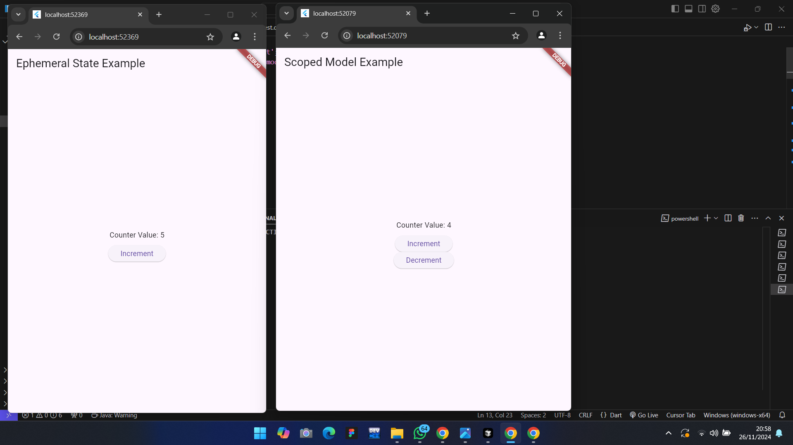

# Lab Activity 2 - State Management
- Mata Kuliah: Visual Programming
- Materi Minggu ke: 9

## **Tentang Proyek**
Proyek ini berisikan dua impelementasi State Management di Flutter yaitu:
1. **Ephemeral State Management** dengan menggunakan `StatefulWidget`
2. **App State Management** dengan menggunakan `scoped_model`

State Management merupakan salah satu komponen penting dalam pengembangan suatu aplikasi Flutter, terutama ketika bekerja dengan aplikasi yang lebih kompleks.

---

## **Kesimpulan**
Kesimpulannya yaitu bahwa Ephemeral State Management cocok untuk kasus sederhana dengan state lokal yang sementara. Namun, App State Management seperti `scoped_model` lebih kuat dan fleksibel untuk aplikasi yang berskala besar dan kompleks. Dengan menggunakan Scoped Model, developer dapat mengelola state aplikasi secara efisien dan terstruktur, terutama dalam kasus penggunaan seperti **user authentication*, keranjang belanja (**shopping cart*), atau data global lainnya

---
## **Screenshot**
Here's the screenshot to see the differences

